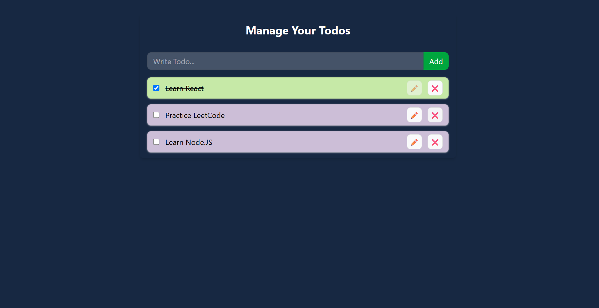

# Todo App

A task management application built using React, Zustand, and Tailwind CSS. This application allows users to efficiently manage their daily tasks by creating, updating, deleting, and tracking the completion status of todos.

The project focuses on implementing modern React development practices, including component-based architecture and centralized state management using Zustand. Persistent storage is implemented using Zustand Persist and LocalStorage, ensuring that user data remains available even after refreshing or reopening the application.

## Live Demo

Add your Vercel deployment link here:

https://your-todo-app.vercel.app

## Screenshot



## Features

- Create new tasks with a unique identifier
- Update existing tasks
- Delete tasks from the list
- Mark tasks as completed or incomplete
- Persistent task storage using LocalStorage
- Global state management using Zustand
- Clean and responsive user interface
- Component-based React architecture

## Tech Stack

- **React** - Frontend library for building user interfaces
- **Zustand** - Lightweight state management solution for managing application data
- **Tailwind CSS** - Utility-first CSS framework for responsive styling
- **Vite** - Fast development and build tool
- **LocalStorage** - Client-side storage for maintaining task data

## Project Structure
src/
│
├── Components/
│ ├── TodoForm.jsx
│ └── TodoItem.jsx
│
├── ZustandStore/
│ └── coursestore.js
│
├── App.jsx
├── main.jsx
└── index.css

## State Management

The application uses Zustand to manage the global state of the todo list. The Zustand store contains the task data along with functions responsible for modifying the state.

The store handles:

- Adding new tasks
- Updating existing tasks
- Removing tasks
- Changing task completion status

Zustand Persist middleware is used to synchronize the application state with LocalStorage. This removes the need for manually handling storage operations with React lifecycle methods.

## Installation and Setup

Clone the repository:

```bash
git clone https://github.com/your-username/todo-app.git